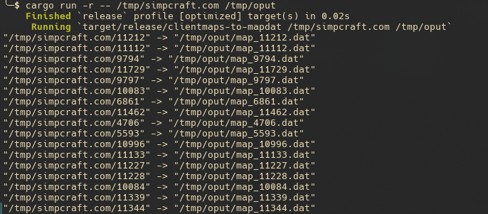
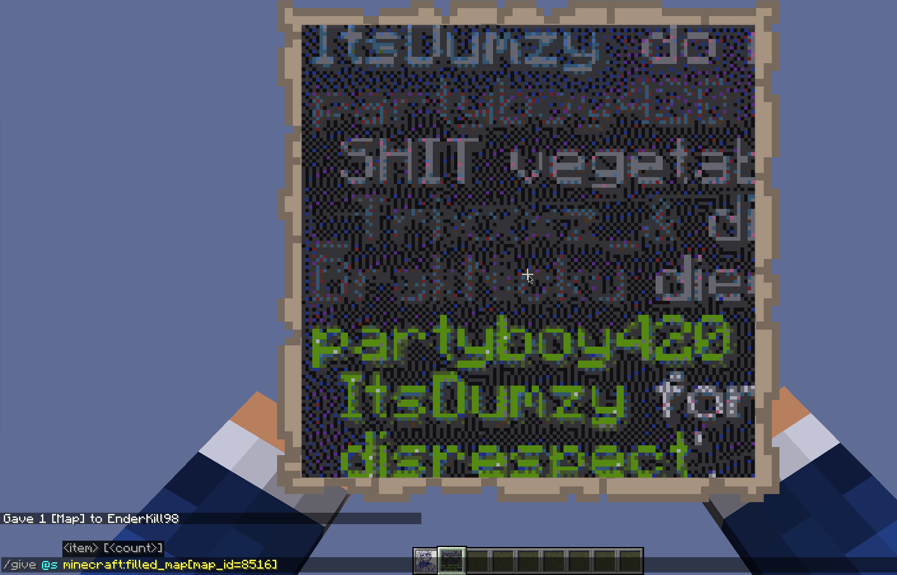

# clientmaps to mapdat

Does a best-effort at converting files created by the Mod [Client Maps](https://modrinth.com/mod/client-maps) into map.dat files.

This is a simple cli utility that takes
 - the input directory (/path/to/.minecraft/.client_maps/server.tld/)
 - the output directory (/path/to/serverfolder/world/data)

Ofc don't use the actual folders above first. Put them into some empty folder and copy them over, otherwise it would override existing files in world/data!

All the maps will be locked, technically at 64M, 64M (center) in overworld and locked with no banners or other POIs on them. The content is an exact copy from Client Maps which should in turn have been the exact data the client received from the server. So the content should be pixel-perfect.

